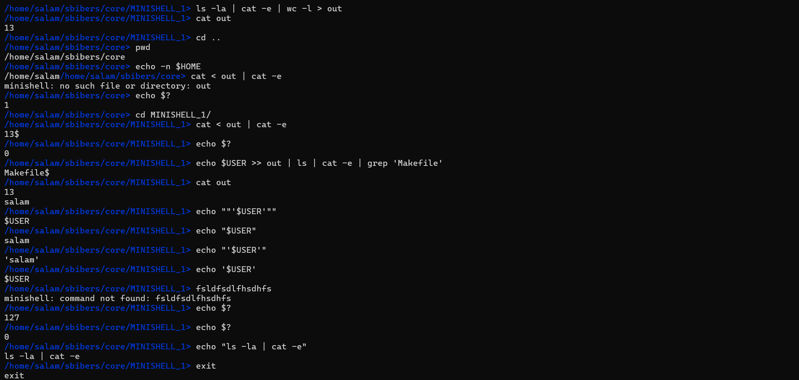

## Example of Minishell in Action 🖥️

42 project, recoding our own little bash. A program capable of parsing a prompt and launching executables with arguments, along with a few built-in functions.

---

## Project Specifications

For this project, we were allowed to use **GNU's readline** library, which handles terminal interaction (history & input reading). For everything else, the subject allows only a few low-level functions and a few POSIX system calls.

### Allowed Functions

The following functions were allowed for the project:
- `readline`, `rl_clear_history`, `rl_on_new_line`, `rl_replace_line`, `rl_redisplay`, `add_history`
- `printf`, `malloc`, `free`, `write`
- `access`, `open`, `read`, `close`, `fork`, `wait`, `waitpid`, `wait3`, `wait4`
- `signal`, `sigaction`, `sigemptyset`, `sigaddset`, `kill`
- `exit`, `getcwd`, `chdir`, `stat`, `lstat`, `fstat`, `unlink`
- `execve`, `dup`, `dup2`, `pipe`
- `opendir`, `readdir`, `closedir`
- `strerror`, `perror`
- `isatty`, `ttyname`, `ttyslot`, `ioctl`
- `getenv`, `tcsetattr`, `tcgetattr`, `tgetent`, `tgetflag`, `tgetnum`, `tgetstr`, `tgoto`, `tputs`

---

## How to use it

Using `make` will create the `minishell` executable.

Simply run it with: ./minishell

---

## Available Options

- **Executables**: `Minishell` runs executables from an absolute, relative, or environment path (`/bin/ls` or `ls`), including arguments or options.
- **Environment Variables**: Environment variables such as `$HOME` are handled, and the return code `$?` is supported.
- **Redirections**: You can use redirections such as `>`, `>>`, `<`, and pipes `|`.
- **Quotation Marks**: Both single quotes (`'`) and double quotes (`"`) work the same as in Bash, except for multiline commands.
- **Control Keys**:
  - `Ctrl-C` interrupts the current command.
  - `Ctrl-\` quits a program.
  - `Ctrl-D` sends an EOF, just like in Bash.

---

## Features

### Basics
- **History**: Keeps track of the previously entered commands.
- **Command Execution**: Searches and launches the right executable based on the `PATH` variable, using relative or absolute paths.
- **Environment Variables**: Expands variables (e.g., `$HOME`).
- **Wildcards**: Handles wildcards (`*`) in the current working directory.
- **Control Keys**: 
  - `Ctrl-C`, `Ctrl-D`, and `Ctrl-\` behave like in Bash.
  - `'` (single quotes) prevent interpreting meta-characters inside the quoted sequence.
  - `"` (double quotes) prevent interpreting meta-characters, except for `$`.
- **Exit Status**: Expands `$?` to the last exit status.
- **Pipes**: Allows connecting commands or groups with pipes; output of a command is connected to the input of the next command via a pipe.

### Built-ins
- **echo**: Supports the `-n` option.
- **cd**: Supports relative and absolute paths, `-` for OLDPWD, and no arguments for HOME.
- **pwd**: Without options.
- **export**: Without options.
- **unset**: Without options.
- **env**: Without options.
- **exit**: Accepts an optional `exit_status`.

### Redirections
- **Input Redirection** (`[n]< file`): Redirects input from a file.
- **Here Document** (`[n]<< limiter`): Supports here-documents.
- **Output Redirection** (`[n]> file`): Redirects output to a file.
- **Append Output** (`[n]>> file`): Appends output to a file.

---

## Project Overview

The goal of this project is to recreate a minimalist shell environment that can interpret commands, handle input and output redirections, process environment variables, and support built-in commands. As part of the 42 School curriculum, this project emphasizes understanding the core functionality of a shell, including process management, file handling, and user input parsing.

---

## Features Recap

- **Command Parsing**: `Minishell` can parse and execute commands, with the ability to handle arguments, options, and environment variables.
- **Redirection and Pipes**: Supports input/output redirections (`>`, `>>`, `<`) and piping (`|`), allowing complex command chaining.
- **Signal Handling**: Implements handling of signals such as `Ctrl-C`, `Ctrl-\`, and `Ctrl-D` to control the shell's behavior.
- **Exit Status**: The return status of the last executed command is stored and can be accessed via `$?`.

---

## Built with

- **C programming language**: The core of `minishell` is written in C, using basic system calls to handle user input and execute commands.
- **Makefile**: For compiling and managing the build process.

